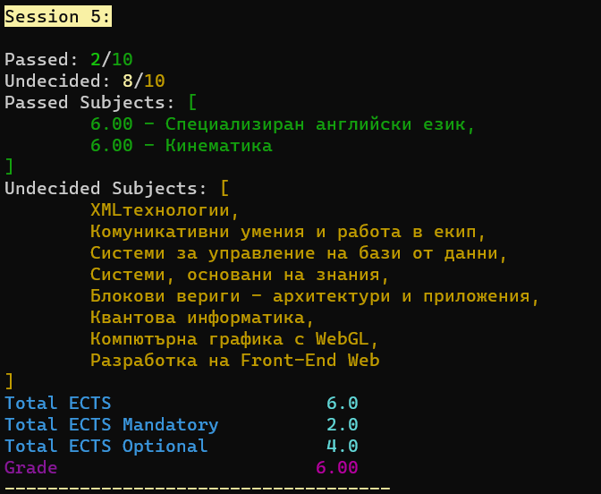
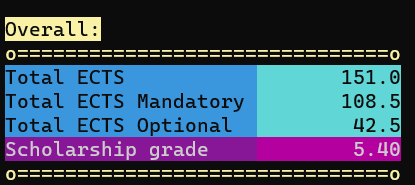

# SusiAPI
SusiAPI is a Python web scraper designed to retrieve student grades from [susi.uni-sofia.bg](susi.uni-sofia.bg). It is a simple tool that automates the process of accessing and extracting grades, saving time for students who need to frequently check their academic performance online. It also displays the accumulated ECTS credits both from the mandatory and extracurricular courses, as well the grade formed for a scholarship.

This is a personal project, created for educational purposes. It is not affiliated with the University of Sofia.

__This is only a proof of concept.__

## Installation

### Windows
Run `install.bat`

### Linux/MacOS
Run `py -m venv venv`\
then `./venv/Scripts/activate`\
then `pip install -r requirements.txt`

## Usage

If you ran the installer, you can simply run `run.bat` to start the program.

Otherwise:\
Run `venv\Scripts\activate.bat` (Windows) or `./venv/Scripts/activate` (MacOS/Linux)\
then `py susi_api.py` in the project directory.

## Examples

